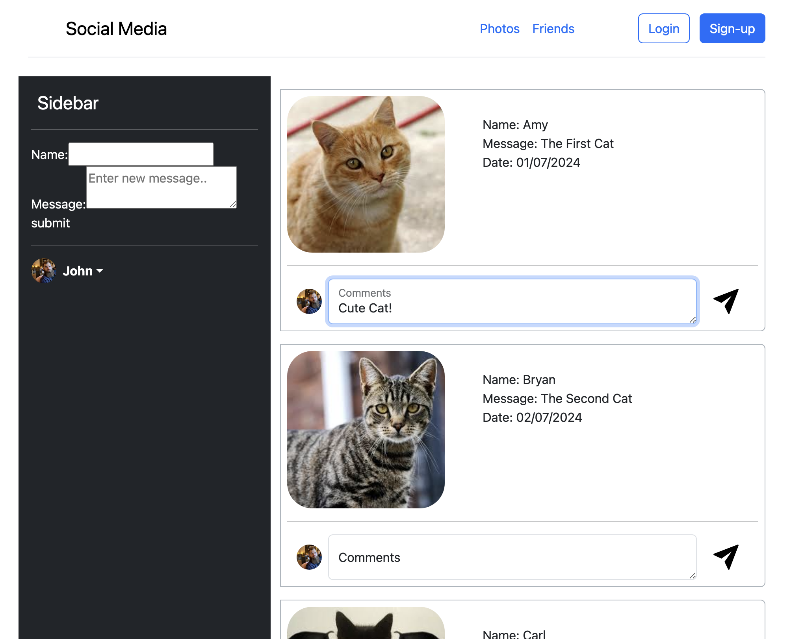
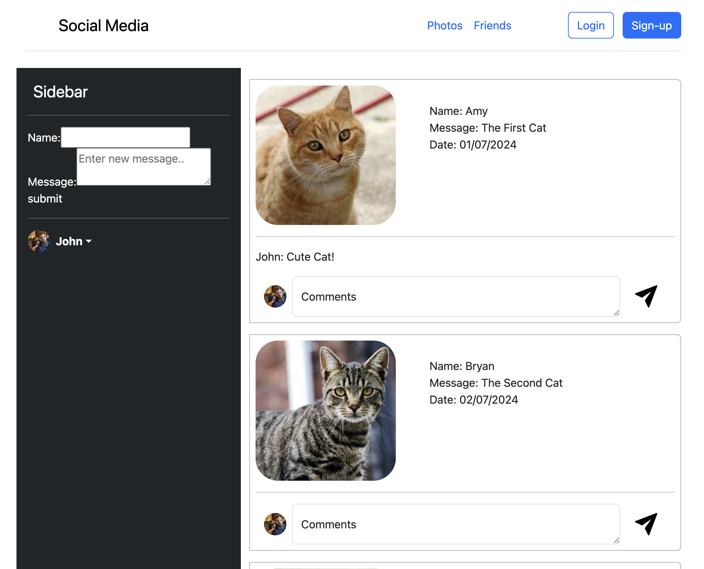

# Web Application Development Workshops (7005ICT / 2703ICT)

---

## 📘 Repository Overview
This repository contains **workshops and exercises** completed as part of the **Web Application Development** course at Griffith University. The workshops cover topics such as web development basics, server-side programming, database integration, CRUD operations, and secure web application development.

Each folder corresponds to a weekly workshop with tasks designed to build skills in full-stack web development.

---

## 🛠 Weekly Topics & Learning Objectives

| Week | Topic                                | Description                                    |
|------|---------------------------------------|------------------------------------------------|
| 1    | Development Environment & Responsive Design | Setting up the environment and using front-end frameworks |
| 2    | PHP Part 1                           | Introduction to server-side programming        |
| 3    | PHP Part 2                           | Handling form input, sanitisation, and validation |
| 4    | Web Framework                        | Routing, views, templating, and CSRF prevention |
| 5    | Database and SQL                     | Designing databases and writing SQL queries    |
| 6    | CRUD Operations                      | Implementing Create, Retrieve, Update, Delete with SQL |
| 8    | Database Migration & MVC             | Database migration, seeding, MVC separation, ORM |
| 9    | Input Validation & Authentication    | Implementing validation rules and user authentication |
| 10   | File Uploads, Pagination, Date/Time  | Managing file uploads, pagination, and date handling |

---

## 🗂 Workshop Overview

#### Week 1: Development Environment & Responsive Design
Set up a development environment and built a **responsive** social media page using HTML and Bootstrap, implementing basic structure and layout. [**View Details**](./week1/README.md)
- Directory: `week1/task4/` 

| Desktop View | Tablet View | Mobile View |
|---|---|---|
|  |  |  |

#### Week 2: PHP Part 1
Implemented a social media page using PHP with **object-oriented principles** by creating Post and Comment classes, and enhanced code clarity and data safety through type declarations. [**View Details**](./week2/README.md)
- Directory: `week2/task2/`

| Desktop View (≥ 992px)                    | Tablet View (Large: 768px ~ 991px)          | Tablet View (Small: 576px ~ 767px)          | Mobile View (≤ 575px)                      |
|--------------------------------------------|---------------------------------------------|---------------------------------------------|---------------------------------------------|
|  |  |  |  |

**Note:** Comment sections are not functional yet.

#### Week 3: PHP Part 2
This week builds upon the Week 2 social media page by implementing **form handling** in PHP. Users can submit comments via forms using GET requests, with data stored and accessed through PHP **superglobals** like $_GET and $_REQUEST. The comment functionality was further enhanced by using PHP **sessions** to persist data across page reloads. Other tasks in this workshop demonstrated input validation, error handling, and file handling. [**View Details**](./week3/README.md)
- Directory: `week3/social-session/`

| Home Page | Comment Added |
|-|-|
|  |  |

#### Week 4: Web Framework
This week focused on **Laravel**, covering routing, controllers, Blade templating, and CSRF protection.
These concepts were applied in user authentication, session management, and CRUD operations for posts and comments.

The highlight of this week is **My Social**, a social media app where users can sign up, create posts, and leave comments. It integrates authentication, database-driven content management, and dynamic comment persistence, ensuring that comments are stored in the database and displayed dynamically. Built using Laravel’s **MVC architecture, Blade templates, and Eloquent ORM**. [**View Details**](./week4/README.md)
- Directory: `week4/task6/`

| Guest View | Sign Up | Login | Create Post | User View | Leave Comment |
|-|-|-|-|-|-|
|  |  |  |  |  |  |

#### Week 5: Database and SQL
In Week 5, a relational schema was designed using SQLite, defining entity relationships and executing SQL queries (SELECT, JOIN, INSERT, UPDATE, DELETE) to manage and retrieve data.
- Directory: `week5/`

#### Week 6 & 8: CRUD Operations & Database Migration & MVC
While separate workshop tasks for these weeks were not completed, full CRUD operations, database migrations, and MVC structure were extensively implemented in Assignment 1. [**View Assignment1**](https://github.com/yourusername/assignment1-repo)

#### Week 9 & 10: Input Validation, Authentication, and File Handling
These topics were covered in the final project, including secure authentication, input validation, file uploads, and pagination using Laravel’s built-in validation rules and middleware security measures. [**View Assignment2**](https://github.com/yourusername/assignment2-repo)

---

## 🛠 Tech Stack & Tools
This course utilised the following technologies and tools:

- **Front-end**: HTML, CSS (Bootstrap, Tailwind), JavaScript (Alpine.js)
- **Database**: MySQL, SQLite (Schema design, relationships, migrations, seeding)
- **Security**: CSRF protection, Input validation, Authentication (Laravel Sanctum, Middleware)
- **DevOps**: Laravel Valet, Composer, GitHub for version control

---

## 📝 Assignments Overview
- **Assignment 1**: [Simple CRUD Web Application Repository](https://github.com/yourusername/assignment1-repo)  
- **Assignment 2**: [Advanced Web Application Repository](https://github.com/yourusername/assignment2-repo)

---

## 📚 Course Overview
This course introduces the systematic development of dynamic, database-backed web applications using HTML/CSS, server-side programming languages (such as PHP), and modern web frameworks (e.g., Laravel). Through weekly exercises and projects, students will gain hands-on experience with CRUD operations, user authentication, database integration, input validation, and secure web application development.

---

## 🏆 Learning Outcomes
By the end of the course, students will be able to:
1. Build secure, functional, database-backed dynamic web applications using a modern web framework.
2. Analyse project requirements and recommend suitable web technologies, frameworks, and databases.

---

## 📞 Course Staff
- **Convenor**: Dr. David Chen  
  - Email: [david.chen@griffith.edu.au](mailto:david.chen@griffith.edu.au)  
  - Phone: (07) 373 53675  