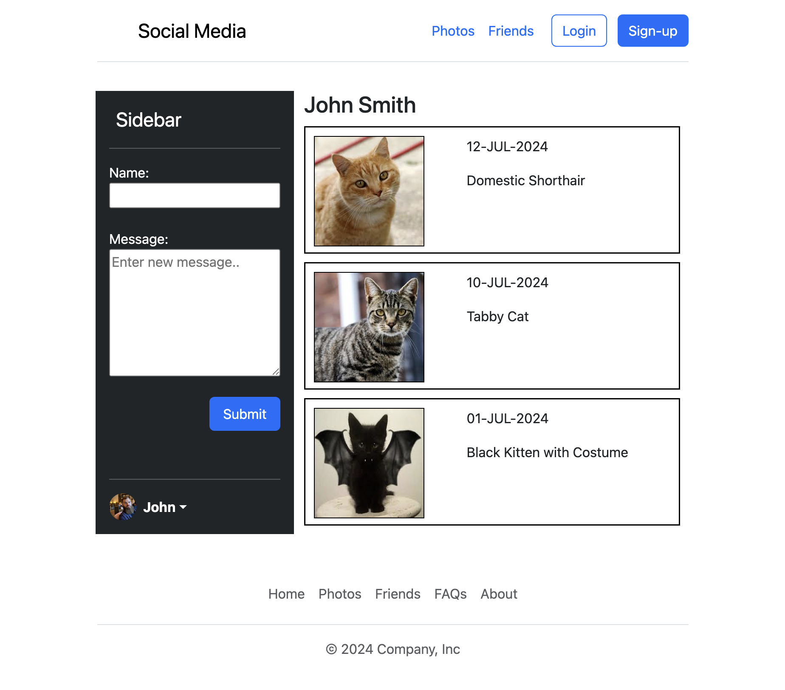

# Web Application Development Workshops (7005ICT / 2703ICT)

---

## 📘 Repository Overview
This repository contains **workshops and exercises** completed as part of the **Web Application Development** course at Griffith University. The workshops cover topics such as web development basics, server-side programming, database integration, CRUD operations, and secure web application development.

Each folder corresponds to a weekly workshop with tasks designed to build skills in full-stack web development.

---

## 🛠 Weekly Topics & Learning Objectives

| Week | Topic                                | Description                                    |
|------|---------------------------------------|------------------------------------------------|
| 1    | Development Environment & Responsive Design | Setting up the environment and using front-end frameworks |
| 2    | PHP Part 1                           | Introduction to server-side programming        |
| 3    | PHP Part 2                           | Handling form input, sanitization, and validation |
| 4    | Web Framework                        | Routing, views, templating, and CSRF prevention |
| 5    | Database and SQL                     | Designing databases and writing SQL queries    |
| 6    | CRUD Operations                      | Implementing Create, Retrieve, Update, Delete with SQL |
| 8    | Database Migration & MVC             | Database migration, seeding, MVC separation, ORM |
| 9    | Input Validation & Authentication    | Implementing validation rules and user authentication |
| 10   | File Uploads, Pagination, Date/Time  | Managing file uploads, pagination, and date handling |

---

## 🗂 Workshop Overview

#### Week 1: Development Environment & Responsive Design
| Desktop View | Tablet View | Mobile View |
|---|---|---|
|  |  |  |

#### Week 2: PHP Part 1

#### Week 3: PHP Part 2

#### Week 4: Web Framework

#### Week 5: Database and SQL

#### Week 6: CRUD Operations

#### Week 8: Database Migration & MVC

#### Week 9: Input Validation & Authentication

#### Week 10: File Uploads, Pagination, and Date/Time

---

## 🛠 Tech Stack & Tools
During the course, you will use various technologies and tools, including:

- **Programming Languages**: PHP, HTML, CSS, JavaScript  
- **Web Frameworks**: Laravel  
- **Database**: MySQL, SQLite  
- **Development Environment**: Composer, Laravel Valet (or alternative server setup)  
- **Version Control**: Git and GitHub  

---

## 📝 Assignments Overview
- **Assignment 1**: [Simple CRUD Web Application Repository](https://github.com/yourusername/assignment1-repo)  
- **Assignment 2**: [Advanced Web Application Repository](https://github.com/yourusername/assignment2-repo)

---

## 📚 Course Overview
This course introduces the systematic development of dynamic, database-backed web applications using HTML/CSS, server-side programming languages (such as PHP), and modern web frameworks (e.g., Laravel). Through weekly exercises and projects, students will gain hands-on experience with CRUD operations, user authentication, database integration, input validation, and secure web application development.

---

## 🏆 Learning Outcomes
By the end of the course, students will be able to:
1. Build secure, functional, database-backed dynamic web applications using a modern web framework.
2. Analyze project requirements and recommend suitable web technologies, frameworks, and databases.

---

## 📞 Course Staff
- **Convenor**: Dr. David Chen  
  - Email: [david.chen@griffith.edu.au](mailto:david.chen@griffith.edu.au)  
  - Phone: (07) 373 53675  