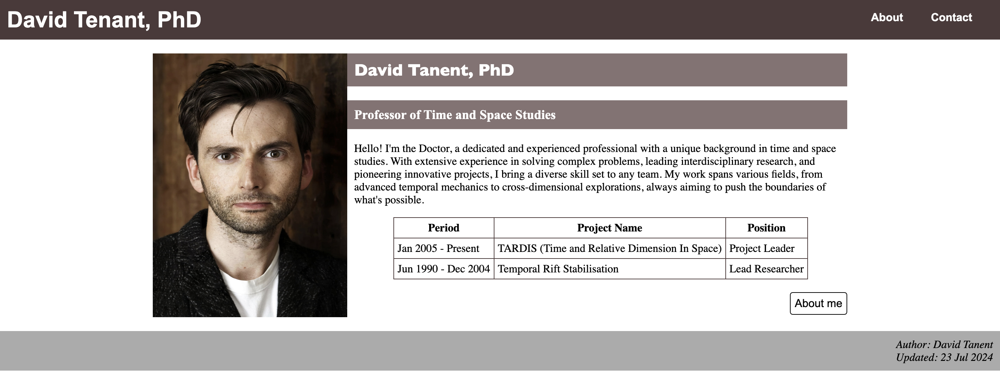
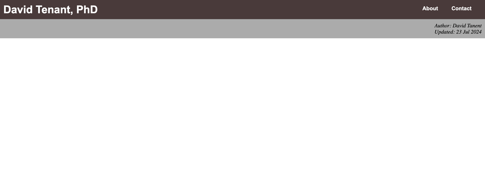
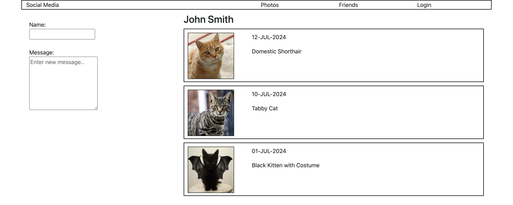
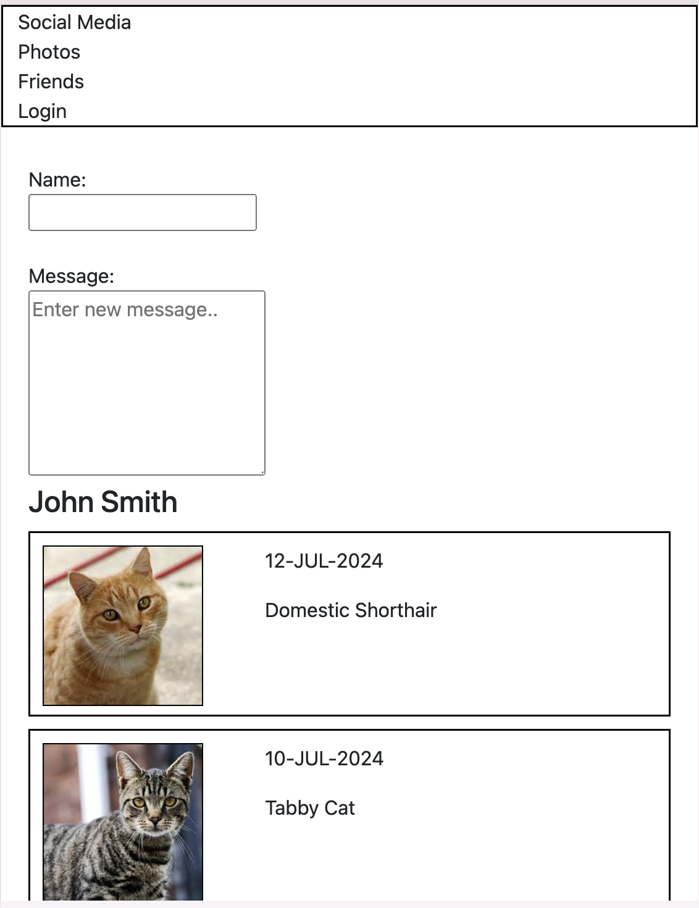
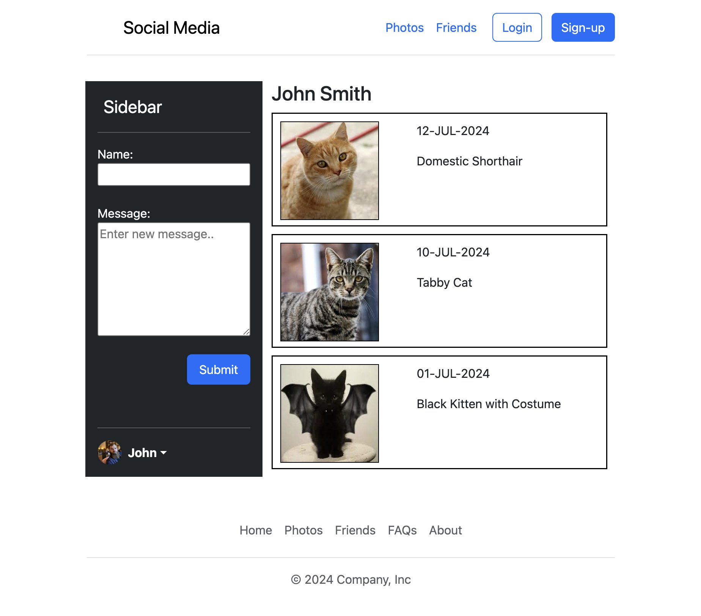
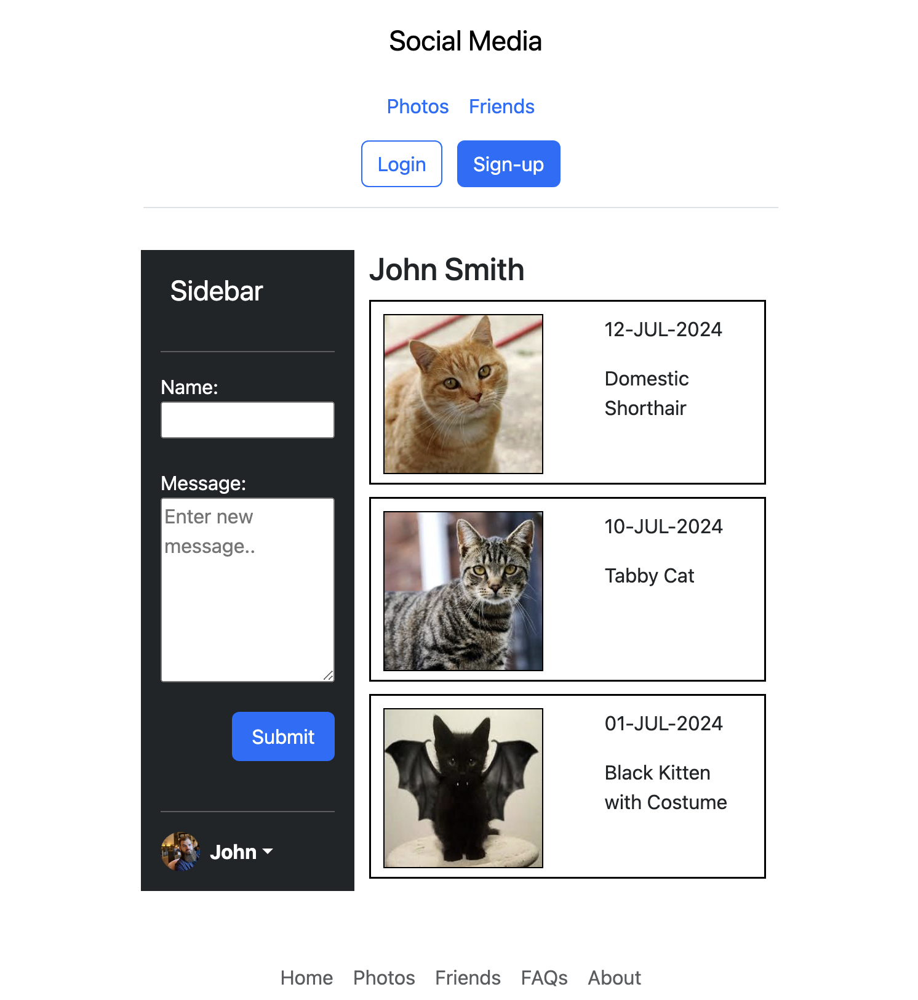
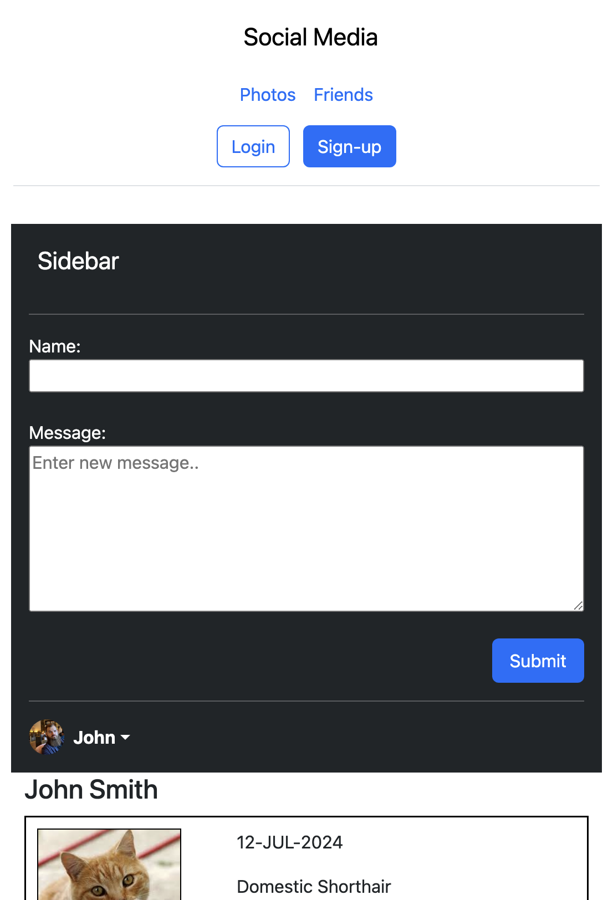

# Week 1: Development Environment & Responsive Design

## 📝 Overview
This week's workshop focuses on setting up a development environment and creating responsive web pages using HTML and Bootstrap. You will complete tasks related to various HTML elements, page layout, and responsive design.

For detailed instructions, refer to the PDF below:
- **[Exercise 1 - HTML and Bootstrap.pdf](./Exercise%201%20-%20HTML%20and%20Bootstrap.pdf)**

---

## 🎯 Learning Objectives
- Set up a web development environment.
- Create HTML pages with elements such as headings, lists, and tables.
- Implement responsive web page layouts using Bootstrap.

---

## 🛠 Tasks Overview

### **Task 1: Development Environment Setup**
- Create a simple "Hello World" HTML page.
- Directory: `week1/task1/`

---

### **Task 2: Profile Page with HTML and CSS**
- Create a profile page for **David Tenant, PhD**.
- Include a navigation bar, profile section, and a table.
- Directory: `week1/task2/`
  
#### **Preview**
| Home Page | About Page |
|--------------|-------------|
|  |  |

---

### **Task 3: Responsive Page with Bootstrap**
- Build a responsive social media page with posts and a form.
- Use Bootstrap’s grid system to create a responsive layout.
- Directory: `week1/task3/`

#### **Preview**
| Desktop View | Mobile View |
|--------------|-------------|
|  |  |

---

### **Task 4 : Customize Bootstrap Template**
- Create a fully responsive social media page by customizing a Bootstrap template.
- Include a header, sidebar, posts, and a footer.
- Directory: `week1/task4/`

#### **Preview**
| Desktop View | Tablet View | Mobile View |
|---|---|---|
|  |  |  |

---

## 📂 Files & Directory Structure
```text
week1/
  ├── README.md
  ├── Exercise 1 - HTML and Bootstrap.pdf
  ├── task1/
  ├── task2/
  ├── task3/
  └── task4/
```