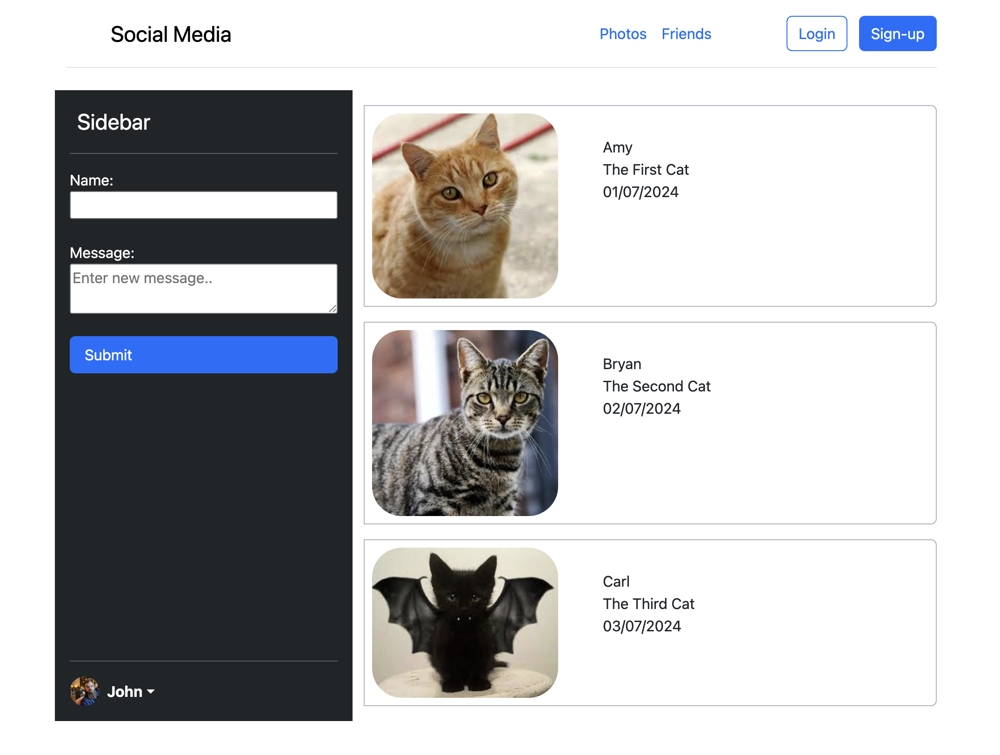
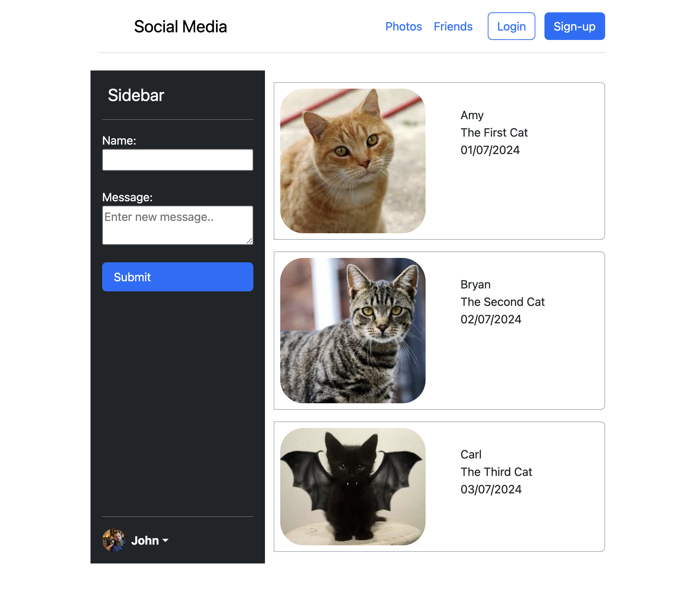
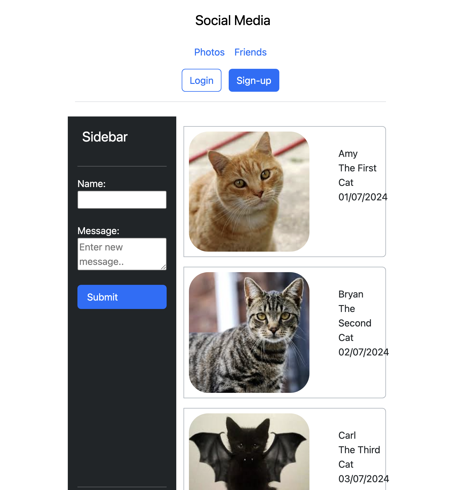
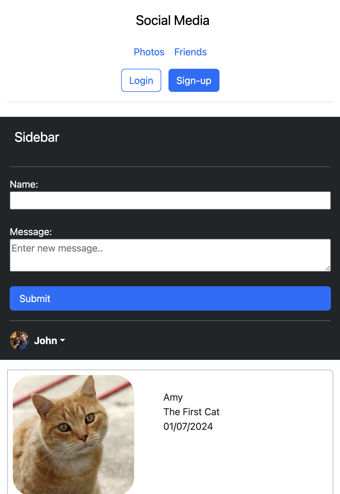
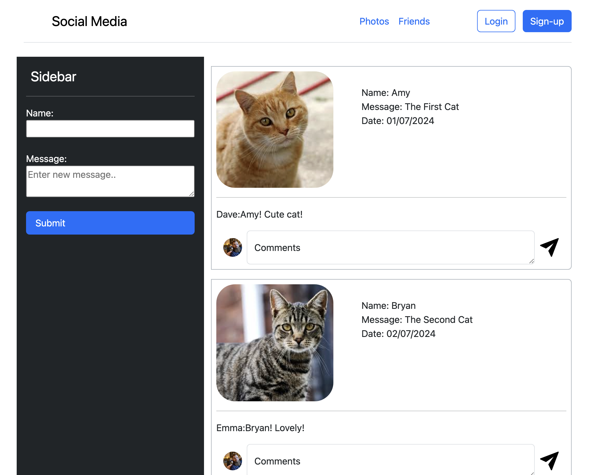
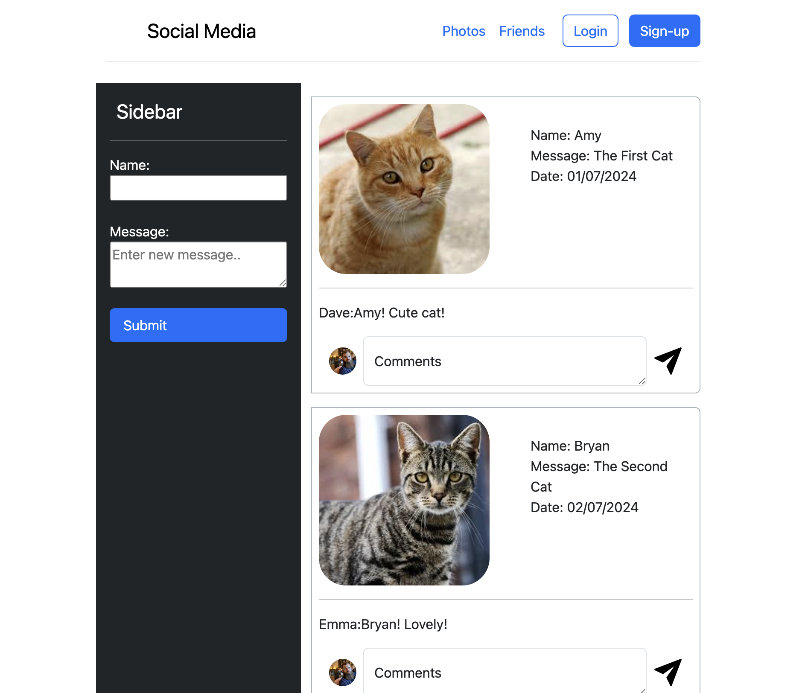
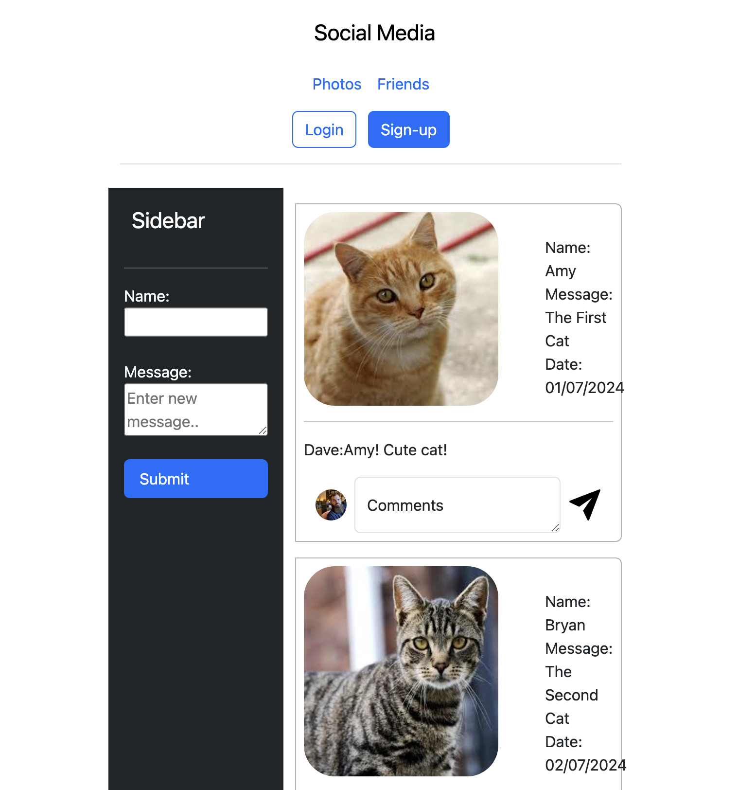
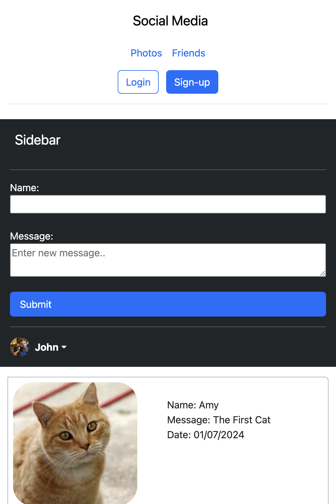

# Week 2: PHP Basics

## 📝 Overview
This week’s workshop introduces PHP programming fundamentals by implementing a simple social media application. You’ll learn how to manage data using arrays and objects, and work with PHP classes, namespaces, and type declarations.

For detailed instructions, refer to the PDF below:
- **[Exercise 2 - PHP.pdf](./Exercise%202%20-%20PHP.pdf)**

---

## 🎯 Learning Objectives
- Understand PHP syntax and basic programming concepts.
- Implement data storage using arrays and objects.
- Use classes, namespaces, and type declarations in PHP.
- Practice object-oriented programming (OOP) concepts in a web application context.

---

## 🛠 Tasks Overview

### **Task 1: Social Media Application – Array Implementation**
- Build a dynamic social media page that displays posts from an array.
- Implemented using PHP arrays, loops, and Bootstrap for styling.
- Directory: `week2/task1/`

#### **Preview**
| Desktop View (≥ 992px)                    | Tablet View (Large: 768px ~ 991px)          | Tablet View (Small: 576px ~ 767px)          | Mobile View (≤ 575px)                      |
|--------------------------------------------|---------------------------------------------|---------------------------------------------|---------------------------------------------|
|  |  |  |  |

---

### **Task 2 & 3 & 4: Social Media Application – Object-oriented Implementation & Type declarations**
- Build a dynamic social media page that displays posts and comments using PHP classes
- **PostSeeder** and **Post** classes are implemented for handling post data (Task 2), and the **Comment** class is created for handling comments (Task 3).
- **Type declarations** have been added to functions and class properties for better type safety and code clarity (Task 4).
- Implemented using PHP classes, objects, and Bootstrap for styling.
- Directory: `week2/task2/`, `week2/task3/`, `week2/task4/`
  
#### **Preview**
| Desktop View (≥ 992px)                    | Tablet View (Large: 768px ~ 991px)          | Tablet View (Small: 576px ~ 767px)          | Mobile View (≤ 575px)                      |
|--------------------------------------------|---------------------------------------------|---------------------------------------------|---------------------------------------------|
|  |  |  |  |

**Note:** Comment sections have been added to each post from Task1 (not functional).

---

## 📂 Files & Directory Structure
```text
week1/
  ├── README.md
  ├── Exercise 2 - PHP.pdf
  ├── task1/
  ├── task2/
  ├── task3/
  └── task4/
```