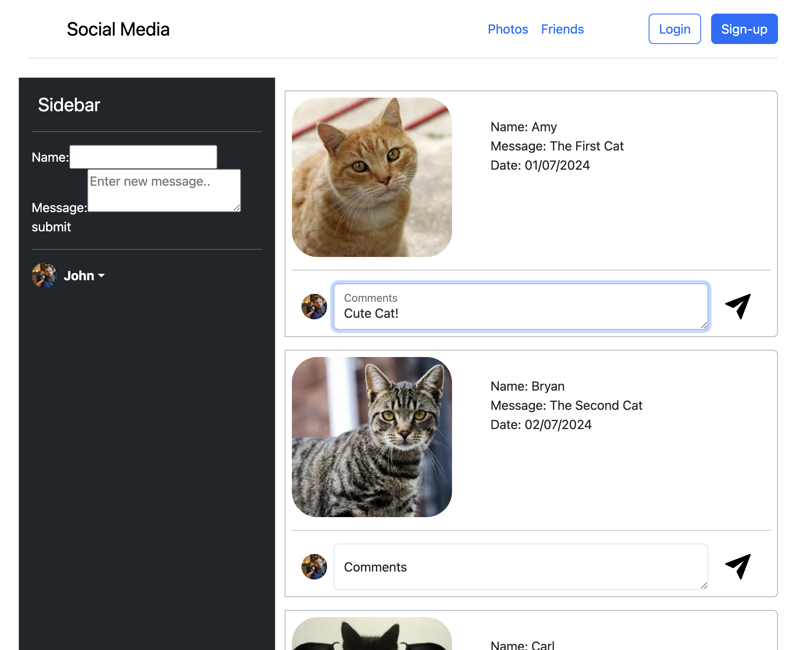
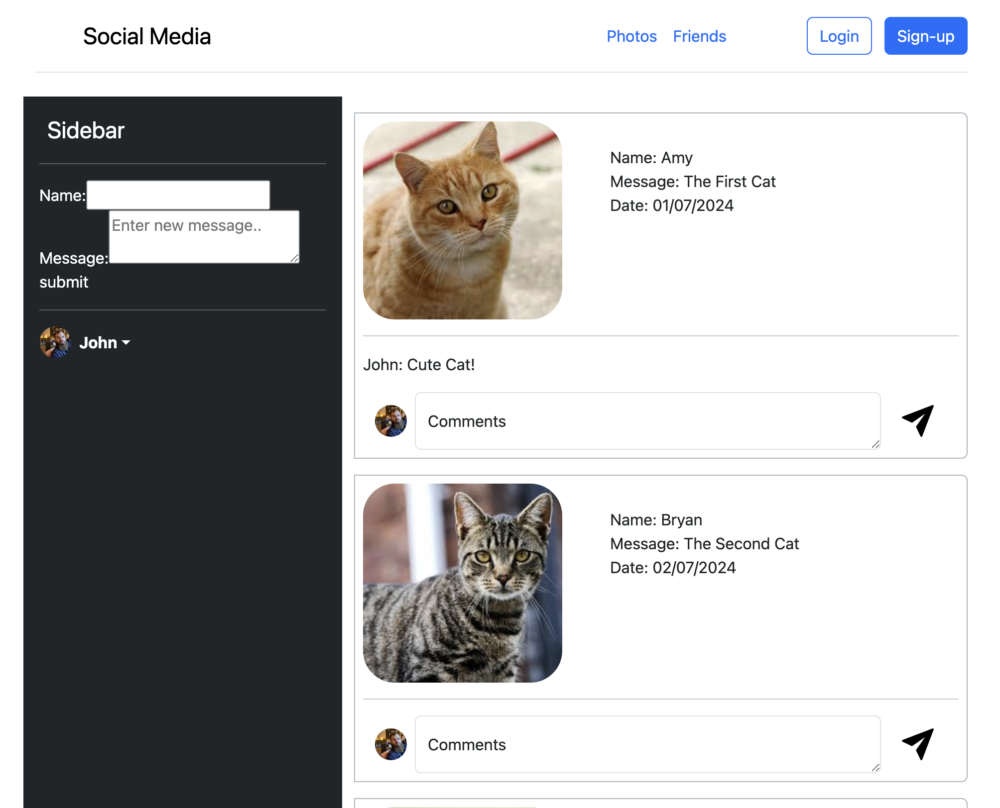
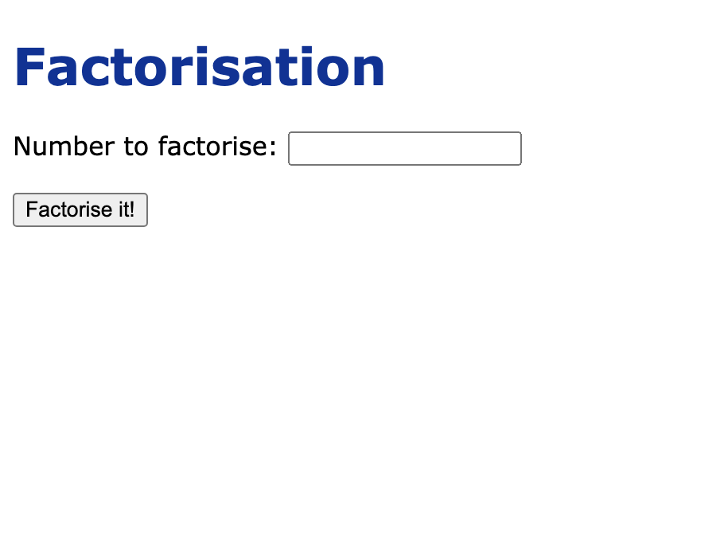
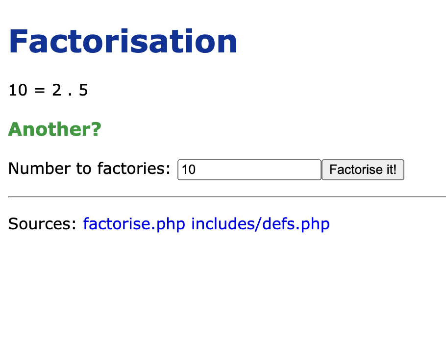
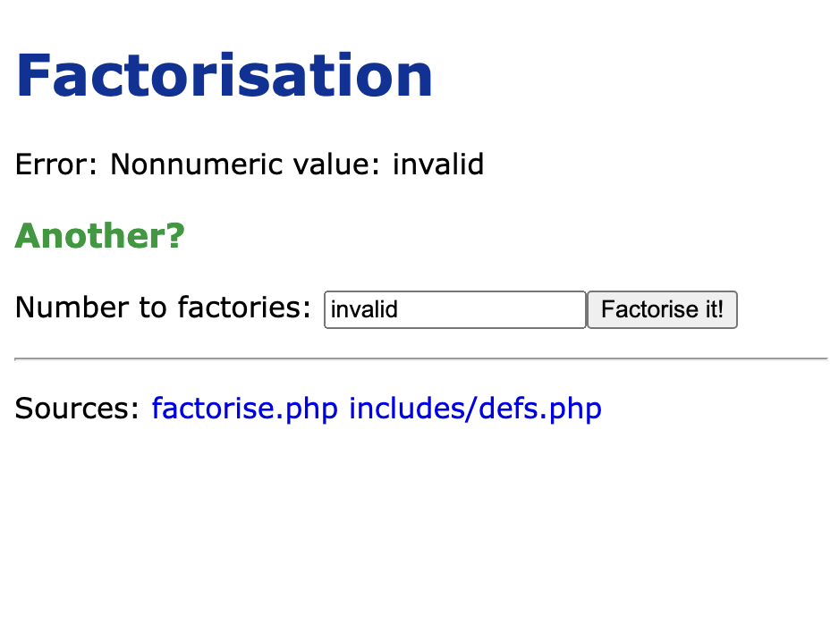
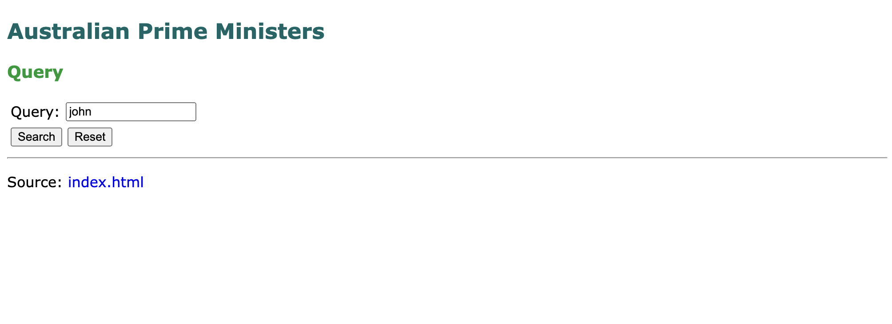
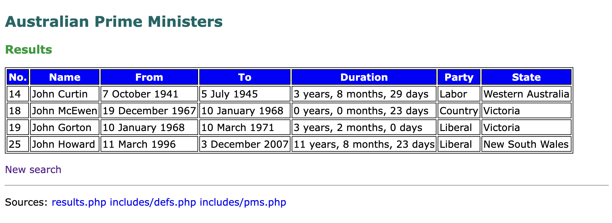

# Week 3: PHP Handling Input

## 📝 Overview
This week’s workshop focuses on form handling and input validation in PHP. You’ll learn how to process form data using the $_GET and $_REQUEST superglobals, validate input fields, and ensure that the data is correctly handled and safe. Additionally, you’ll work with file handling to store results dynamically.

For detailed instructions, refer to the PDF below:
- **[Exercise 3 - PHP Handling Input.pdf](./Exercise%203%20-%20PHP%20Handling%20Input.pdf)**

---

## 🎯 Learning Objectives
- Learn how to handle and process form data using $_GET and $_REQUEST superglobals.
- Implement input validation and error handling to ensure data is valid and errors are properly managed.
- Understand how to perform file handling using PHP’s built-in functions for storing and retrieving data.
- Update existing PHP examples to handle form submissions, process data correctly, and handle potential errors.

---

## 🛠 Tasks Overview

### **Task 2: Social Media Application - Form Handling & Super Globlas**
- a social media page with a form to submit comments and process the form data in PHP.
- In this task, data is submitted through a form using the GET method. When the form is submitted, the data is sent as URL parameters and can be accessed on the server side using PHP’s superglobals, such as $_GET or $_REQUEST.
- Note: To prevent warnings when accessing data from $_GET, always check if the parameter exists before retrieving its value. You can use array_key_exists() or !empty() to ensure the key exists in the array.
- Directory: `week3/task2/`

### **Social Media Application with Sessions**
- Extend the social media page by implementing session-based comment storage.
- This task builds upon Task 2, where PHP sessions are now used to store and manage comments. Users can add comments to posts, and these comments will immediately appear in the comment section and persist during the session, even after the page is reloaded.
- Note: To clear the session and remove all stored comments, visit the clear_session.php page within the social-session folder.
- Directory: `week3/social-session/`

#### **Preview**
| Home Page | Comment Added |
|-|-|
|  |  |

---

### **Task 3: Improved Factorise Example – Error Handling**
- This page allows the user to input a number for factorisation, validates the input, and displays either the factors or an error message based on the validity of the input.
- Implemented using a form to receive the number via the GET method, with error handling for empty, non-numeric, and invalid range inputs.
- Directory: `week3/task3/`
  
#### **Preview**
| Input Form | Valid Input | Invalid Input |
|-|-|-|
|  |  |  |

---

### **Task 4: Prime Ministers Example – Searching**
- Goal: Implement a simple search functionality for the Australian Prime Ministers’ data to filter results based on a query.
- Details: In this task, the data is stored in an associative array simulating a database. A search function is implemented to search through the prime ministers’ data based on user input, such as name, party, state, and other details. The search results are displayed on the same page.
- Directory: `week3/task4/`
  
#### **Preview**
| Input Form | Search Results |
|-|-|
|  |  |

---

### **Task 5: Prime Ministers Example – Input Validation**
- Goal: Implement input validation for searching Australian Prime Ministers’ data, ensuring that user input is valid before performing the search.
- Details: In this task, the data is stored in an associative array simulating a database. A search function is implemented to filter results based on user input, such as name, party, state, and other details. If the input is invalid (e.g., empty fields or non-numeric values for the year), appropriate error messages are displayed. If the input is valid, the search results are shown on the same page.
- Directory: `week3/task5/`
  
#### **Preview**
| Input Form | Empty Fields | Non-numeric Year |
|-|-|-|
|  |  |  |

---

### **Task 7: Improved Factorise Example – File Handling**
- Goal: Modify the factorisation solution to store each factorisation result in a text file. The factorisation results are appended to the file, and then displayed as a list of all previous factorisations below the current one.
- Implementation: After performing the factorisation, the result is written to a file using PHP’s file handling functions (fopen(), fputs(), fclose()). Additionally, all previous factorisations are read from the file and displayed below the new factorisation result.
- Directory: `week3/task7/`
  
#### **Preview**
| Input Form | Empty Fields | Non-numeric Year |
|-|-|-|
|  |  |  |

---

## 📂 Files & Directory Structure
```text
week3/
  ├── README.md
  ├── Exercise 3 - PHP Handling Input.pdf
  ├── social-session/
  ├── task2/
  ├── task3/
  ├── task4/
  ├── task5/
  └── task7/
```