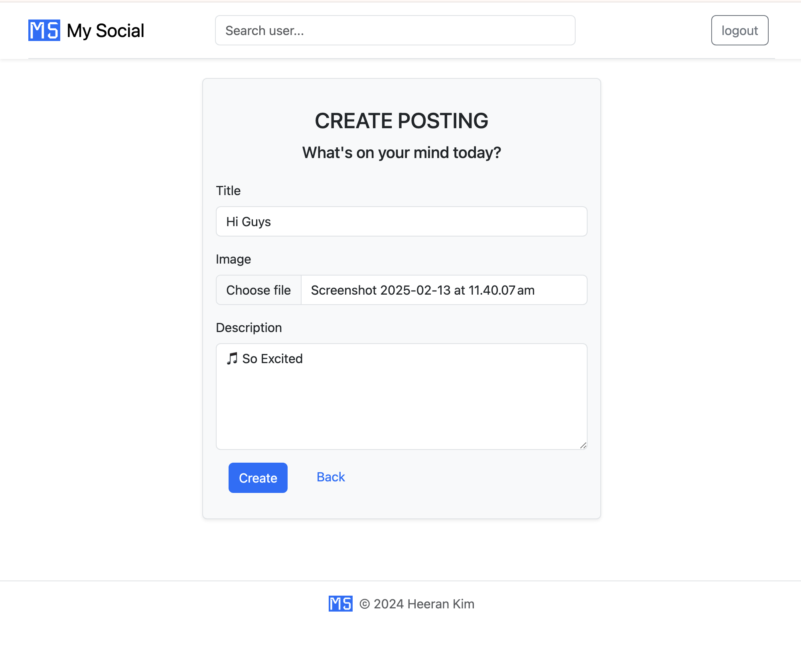
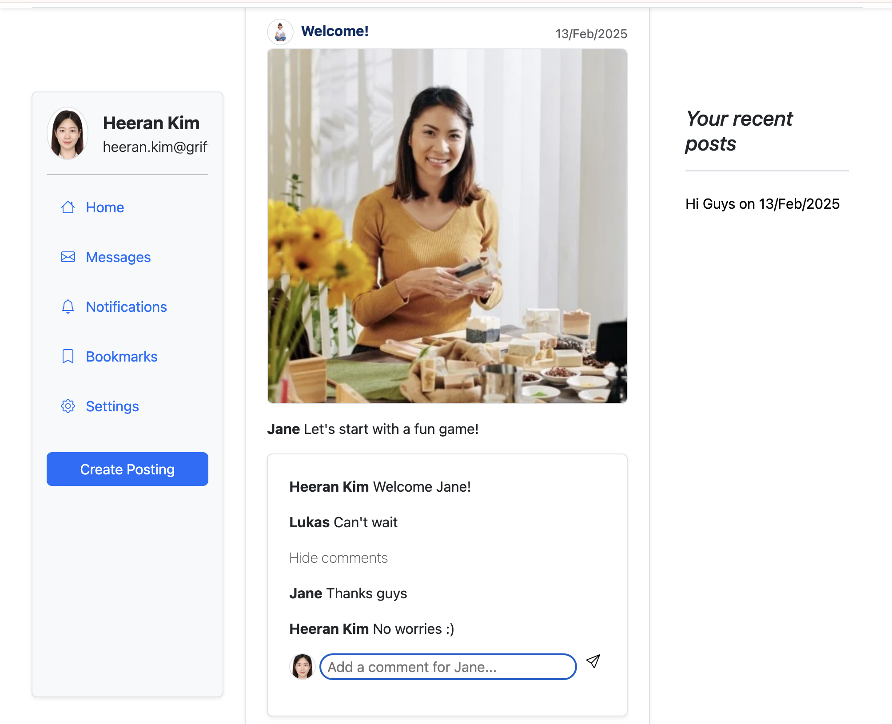

# Week 4: Laravel

## 📝 Overview
This week’s workshop focuses on **Laravel**, a powerful PHP framework for web application development. Throughout this module, we explore Laravel’s core functionalities, including routing, controllers, Blade templates, and security measures like Cross-Site Scripting (XSS) and Cross-Site Request Forgery (CSRF) protection.

For detailed instructions, refer to the PDF below:
- **[Exercise 4 - Laravel.pdf](./Exercise%204%20-%20Laravel.pdf)**

---

## 🎯 Learning Objectives
- Learn how to create, configure, and manage a Laravel project.
- Understand the flow of execution in Laravel applications, including routing, views, and templates.
- Implement dynamic functionality using **Blade templates and inheritance**.
- Utilise **session storage, form validation, and query handling** for dynamic applications.
- Apply **security best practices (XSS, CSRF protection)** in Laravel projects.

---

## 🛠 Tasks Overview

### **Task 1: Laravel Project Setup**
- Set up a new blank Laravel project and confirm installation with the default Welcome page.
- Directory: `week4/task1/`

---

### **Task 2: HELLO – User Information App**
- A simple web application that collects user **name and age** and displays personalized messages. Users can **create, edit, and update** their information dynamically.
- Implemented using **Controllers, Routes, Blade Templates, Session Storage, Form Handling, and Validation**.
- Directory: `week4/task2/`

### **Task 4: Template Inheritance**
- Extends Task 2 by **refactoring the UI using Blade template inheritance** for better maintainability.
- Implemented using **@extends, @section, and @yield** to structure reusable components.
- Directory: `week4/task4/`


#### **Preview (Common for Task 2 & Task 4)**
| Welcome | Input | Submitted | Greeting | Edit | Updated |
|--------------|-----------------|-----------------|-----------------------|------------------|------------------| 
|  |  |  |  |  |  |

---

### **Task 3: Query String Handling with $_GET**
- Dynamically displays key-value pairs from URL query parameters in a formatted table.
- Implemented using **foreach loop with $_GET**, with alternating row colors for better readability.
- Directory: `week4/task3/`
  
#### **Preview**
| Welcome Page | No Input | One Input | Multiple Input |
|-|-|-|-|
|  |  |  |  |

---

### **Task 5: Prime Ministers Search**
- Users can search Australian Prime Ministers by **name, year, and state**, with results displayed dynamically.
  - Unlike the old project, queries now use **AND logic instead of OR logic**.
- Data is stored in an **associative array** (simulating a database), with search results displayed using **foreach loops and alternating row colors**.
- **Client-side validation** prevents invalid inputs (e.g., non-numeric year values).
- Directory: `week4/task5/`
  
#### **Preview**
| Welcome | Search Results | Edit Search | Editted Results |
|-|-|-|-|
|  |  |  |  |

---

### **Task 6: My Social - A Social Media Web App**
- A simple social media platform where users can **sign up, create posts, and comment**.
- Key Features:
  - User **authentication & profile setup** (name, email, profile picture).
  - **Post creation, listing, and deletion** (users can delete only their own posts).
  - **Commenting** functionality.
  - **Client-side & server-side validation** (unique email, password confirmation, title length limit, etc.).
- **Technologies Used**:
  - **Blade templates** with @auth, @include, and **custom components** (x-layout).
  - **Eloquent ORM** for managing Users, Posts, and Comments with queries (::with, ::orderBy).
  - **JavaScript UI enhancements**, including comment toggling and automatic scroll positioning.
- Directory: `week4/task6/`
  
#### **Preview**
| Guest View | Sign Up | Login | Create Post | User View | Leave Comment |
|-|-|-|-|-|-|
|  |  |  |  |  |  |

---

## 📂 Files & Directory Structure
```text
week4/
  ├── README.md
  ├── Exercise 4 - Laravel.pdf
  ├── task1/  # Laravel Project Setup
  ├── task2/  # User Info App
  ├── task3/  # $_GET Query Handling
  ├── task4/  # Blade Template Inheritance
  ├── task5/  # Search Functionality
  └── task7/  # Social Media Web App
```